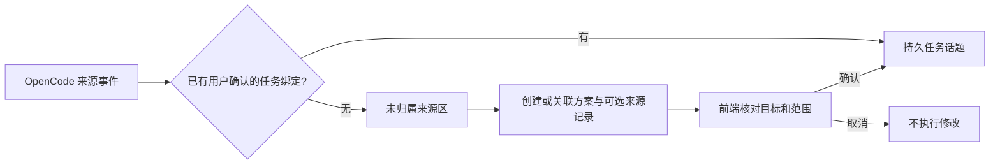
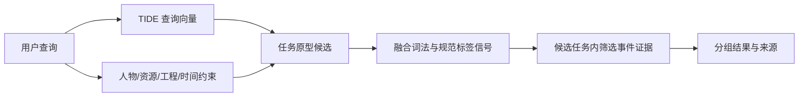

# 持久任务话题、标签生成与合并演示

这次调整把 OpenCode 会话从“话题身份”降为“事件来源”。工程目录是定位线索，一个工程可有多个任务，一个任务可跨多个会话。新建、关联或修改任务记忆均通过可审阅的操作方案执行。

## 用户确认与事件归属

客户端不再根据 session.created、第一条消息或会话标题创建、重命名话题。未关联任务的消息进入未归属区，不参与正式任务检索。用户确认目标与边界后创建话题，或明确选择已有话题；绑定保存于 mp_session_bindings，而不是从最近一条消息反推。

会话侧的创建/选择对话框可以勾选要纳入任务的前序记录，默认不选。此后新事件按用户确认的当前任务绑定归集。切换任务时应再次选择；工程相同不会自动合并，旧会话元数据也不会自动升级为用户确认。



模型工具经 loopback 网关只能查询或提出方案，不能调用 confirm_operation、ingest、forget 等执行入口。前端通过独立 IPC 确认。操作有 pending/executing/applied/rejected/failed 状态、预览指纹与目标修订检查；重复确认不重复执行，目标变化要求重新审阅。失败或中断不会盲目重放。

新建、关联、显式记忆写入、检查点、改名、合并、拆分、迁移、标签复核、字段/事件/话题遗忘均有前端确认路径。查询、恢复和图谱读取不触发确认，也不会顺带创建话题。已完成/已取消的操作记录不保存第二份待写记忆原文，避免操作回执绕过正式记忆的遗忘策略。复合的记忆与偏好写入使用同一事务。

低层 Facade、测试数据生成器和维护脚本仍是可信管理入口，不是操作系统安全沙箱。模型不能通过产品提供的记忆网关自行批准；不能把这一边界描述成对任意 shell/文件系统操作的绝对隔离。

## 标签重点在生成质量，不是固定词表

沿用原有标签结构，不把可用标签内容锁死成一个主题词表。FTS 分词只用于词法检索，不再把整段消息和中文二元切词直接写入标签图谱。自动捕获的原始对话/工具输出也不会自动增加关键词。

- 标签要能帮助定位这件事，而不是重复整句、寒暄、提问、执行成功提示、日期碎片或文件名。
- 新词可以作为候选。自动接受须有对应原文证据和足够置信度；不确定的先待确认，用户确认的有效新词可接受。
- 每个话题最多保留 8 个用于定位的关键词，多余描述作为属性。宽泛词、时间分桶等不作为强图谱连接。
- 人物用稳定身份和角色，资源用稳定 ID 或明确路径；未明确的信息留空，不为补齐类别虚构人物、资源或向量。
- 标签保留来源事件。演示集的语义标签由场景作者指定其支持事件，并记录引用，不将这种标注冒充自动抽取或人工双审结果。
- 复核标签会展示保留/新增的结果和将移除的标签，执行时按来源重新推导。模型未生成有效向量时不会伪造“向量已就绪”标签。

## embedding 模型实际承担什么

当前交付是微调后的 BAAI/bge-base-zh-v1.5：BERT 12 层，768 维，CLS pooling + L2 归一化。读取 safetensors 头部统计为 102,267,648 个参数，约 1.02 亿；不是方案中尚属规划的 20M–30M 双头 Student，也没有已经落地的双空间动态门控或多个独立 Anchor 向量。

实际输入使用交付配置：查询上限 128 tokens（包含固定查询前缀和特殊符号），任务原型上限 384 tokens。原型由稳定名称、目标、少量已知别名和有效关键词构成，不将全部历史、不断变化的路径和人物内部 ID 拼成一个大向量。超限时保留原始证据并回退词法检索，不截掉用户原始记录。



TIDE 用于找候选事项，不能生成事实、直接创建标签、决定删除或代替用户确定任务身份。事件细节由任务内文本与结构化字段检索；人物枚举不依赖向量 Top-K。发生时间和观察/导入时间分开处理，版本比较不把晚到的旧资料视作更新后的当前版本。

FP32 保持默认，混合 INT8 的已有本机对齐失败结论没有被覆盖。自动归题继续关闭；精确的用户绑定有效，但向量首名不会自行改变绑定。

## 新旧演示的整合规则

新演示 persistent-demo-v4 包含 53 个任务话题、284 条事件、132 个来源会话、16 个已命名人物。旧 42 个话题/164 条事件与新 12 个话题/120 条事件全部保留来源映射；仅将旧麒麟桌面适配的 4 条早期记录并入同一麒麟首包任务，因此合计为 53 个话题。

旧示例中的客户名、内部英文代号、无依据的 self、统一 V3 模板和“把所有步骤都标成已完成”等脚手架字段已清理。匿名的甲/乙示例使用明确的虚构名称并保留旧称映射。旧短轨迹没有被冒充成真实访谈；规范化时间与来源会话属于仿真重构，原库的来源时间可追溯。

导入前备份数据库，只归档已知来源且全部事件明确标记为仿真的旧话题；混有真实事件的整个话题保持原样。归档不等于删除，旧原文仍保留。已遗忘来源不会因导入新版演示而复活。重复导入不重复创建。新安装直接使用整合演示，已有库必须通过明确导入/维护授权升级。

资源路径是演示中的结构化引用，并不保证本机存在对应的办公文件。所有记录均标明仿真，模型回答必须与真实项目事实区分；不能用示例中的签收、付款或验收来证明真实项目完成。

## 重现与验证

```bash
cd MemPulse
PYTHONPATH=src MEMPULSE_TEST_MODEL='../微调模型/revision4-model-bundle' .venv/bin/python -m pytest -q --strict-markers -m 'not standalone_webui'
PYTHONPATH=src .venv/bin/python scripts/evaluate_realistic.py --dataset merged \
  --model '../微调模型/revision4-model-bundle' --output ../output/merged-demo-new-run --rounds 3
PYTHONPATH=src .venv/bin/python scripts/prepare_realistic_desktop.py \
  --model '../微调模型/revision4-model-bundle' --data-dir ../output/merged-demo-new-directory
```

已有客户端优先使用话题页的“导入仿真工作记录”确认框。维护迁移时先停止客户端，运行 merge_desktop_demo.py 的无 --apply 预览，再按用户明确授权执行 --apply；脚本自动备份并校验非仿真/混合话题和事件未变。不要把孤立测试库直接覆盖到用户数据目录。

模型结果见 reports/merged-demo-20260915.md。指标是本机仿真检索测试，不是完整大模型回答质量，也不是麒麟原生或正式验收结论。
