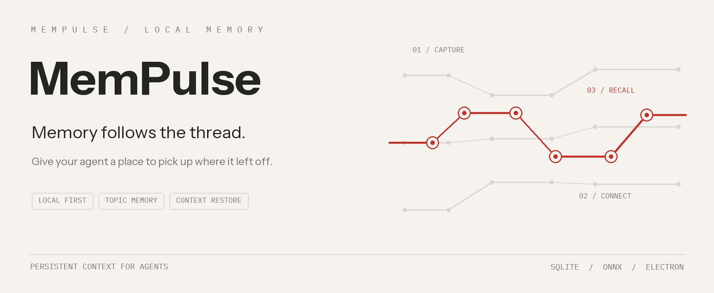
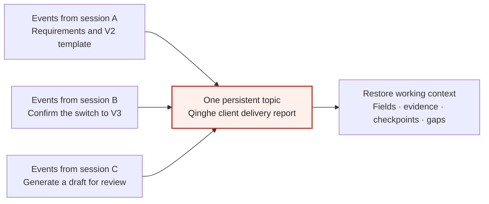
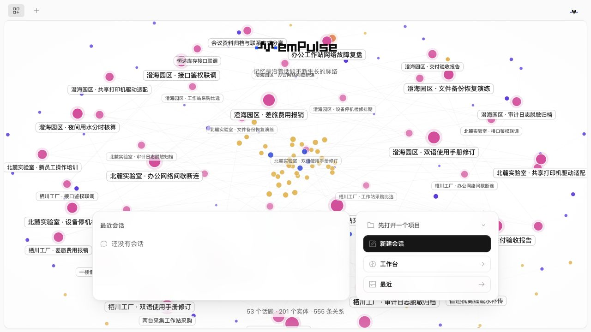
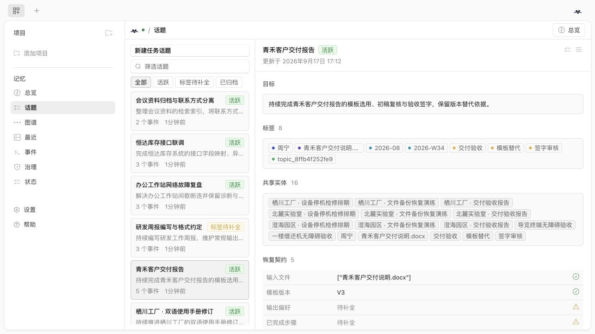
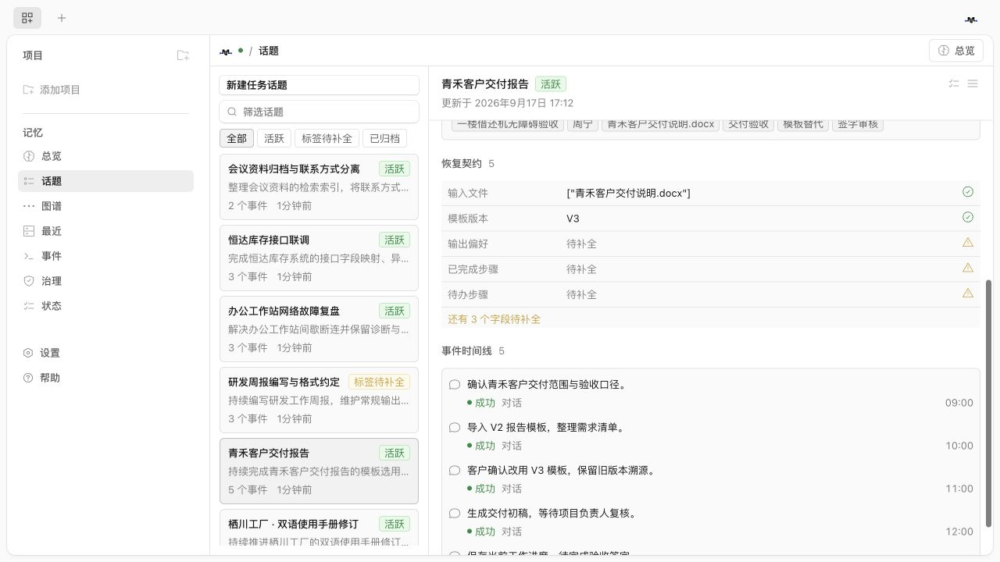
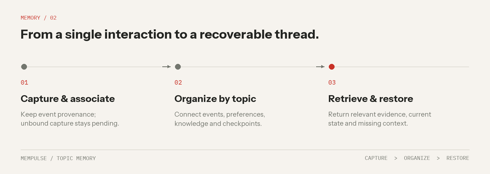
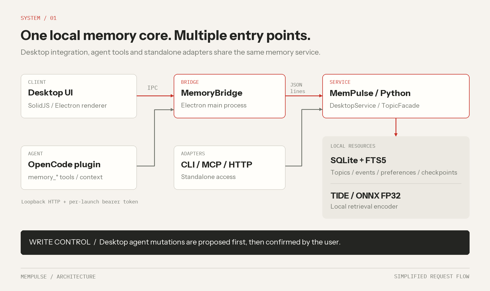

<p align="center">
  
</p>

<p align="center"><strong>English</strong> · <a href="README.zh-CN.md">简体中文</a></p>
<p align="center"><a href="#memory-organized-around-topics">Understanding topics</a> · <a href="#application-screenshots">Screenshots</a> · <a href="#mempulse-and-opencode">Positioning</a> · <a href="#quick-start">Quick start</a> · <a href="#architecture">Architecture</a> · <a href="#models">Models</a> · <a href="#build-and-test">Build & test</a> · <a href="#documentation">Documentation</a></p>

# MemPulse

**Local topic memory for agents. Pick up the work, not just the conversation.**

**MemPulse is an agent-memory solution built around Topics as the core unit of long-term memory.** Each topic represents an ongoing matter, connecting events, evidence and working state across sessions so an agent can find the matter, restore its context and continue the work.

Topics and events are stored locally in SQLite. The memory core runs independently and exposes CLI, MCP and HTTP interfaces. The current desktop integration is built on OpenCode, with plugins for additional IDEs planned.

> **License:** original MemPulse code is available under [Apache-2.0](LICENSE). Third-party code and model assets retain their applicable upstream terms; see [License and attribution](#license-and-attribution).

## Memory organized around topics

### What is a topic?

In MemPulse, a **Topic is a persistent memory unit organized around an ongoing matter, with an identity that survives individual sessions**. It has a goal and a boundary, and accumulates events, evidence, state and checkpoints as the work progresses. “Complete the Qinghe client delivery report,” for example, is a topic. Requirement confirmation, template changes, draft generation and acceptance feedback can all be events within it.

A topic answers: **“What have we been working on, where does it stand, and what is still missing?”** It organizes the working context needed to continue that matter, beyond remembering what was said.

| Concept | Role in MemPulse |
| --- | --- |
| **Topic** | The identity and boundary of an ongoing matter; organizes its goal, event history, related information and recoverable state. |
| Session | An interaction and a source of events. One topic can span several sessions; changing matters within a session requires an explicit change of topic association. |
| Project / directory | Background context for locating work. One project can contain several independent topics. |
| Tags / people / files and other entities | Clues for locating topics and connecting evidence. Sharing these clues does not automatically make two distinct matters one topic. |

### How does a topic grow?

Consider **“Qinghe client delivery report”** from the synthetic demo: the delivery scope is confirmed and a V2 template imported; the client later confirms V3; a draft is then generated for review. These records may come from different sessions while continuing the same matter.



*Conceptual example: related events enter the same topic after their association is established. Sessions supply the events; the topic maintains the continuing memory.*

A topic brings together:

- **Goal and boundary:** what the work is intended to accomplish, and which nearby matters belong to other topics.
- **Events and provenance:** what happened, when it happened and the supporting sources needed for later review.
- **Relationships and applicable information:** people, resources and tags, with preferences and knowledge resolved by scope and version.
- **Recoverable state:** recorded context fields, checkpoints and missing information that help a later session resume the work.

“Organize the shared template library” can be a separate topic in the same project. Even if it involves the same people and template files, its goal and boundary remain distinct. Related topics can be connected without being automatically merged because their words look similar.

### From finding a topic to continuing the work

When a user starts a new session with “Continue the Qinghe delivery report,” MemPulse focuses on:

1. **Locating the topic:** use names, people and resources alongside lexical search, structured relationships and optional TIDE embeddings to find candidate topics, then select relevant event evidence. Ambiguity calls for clarification.
2. **Restoring context:** return recorded fields, supporting evidence, an available checkpoint and gaps for the identified topic. In this example, the input file and current V3 template can be restored with evidence for the change. Output preferences or step status that have not been recorded as structured fields remain explicitly missing.
3. **Continuing the history:** in the desktop integration, once the user confirms topic creation or association, subsequent captured events follow the current binding. The topic keeps growing across sessions instead of requiring a fresh task memory for every chat.

Unbound capture stays pending. Creating a session, changing its title or ranking first in vector search does not automatically create, rename or rebind a topic. Retrieval and restoration are reads; memory mutations follow their respective confirmation flows.

See the [topic and task contract](MemPulse/docs/TOPIC-CONTRACT-20260915.md) (Chinese) for detailed association, tagging, retrieval and governance rules.

## MemPulse and OpenCode

**We provide a reusable, topic-centered memory solution for agents.** We chose [OpenCode](https://github.com/anomalyco/opencode), an excellent open-source project, as the foundation for our current desktop client. Its sessions, tool execution, terminal and desktop interactions let us focus on persistent topic memory, evidence retrieval, context restoration and memory governance. We are grateful to the OpenCode community for that foundation.

OpenCode is the basis of our current complete desktop integration; **it is not the only host the MemPulse memory solution is designed to support**. The independent service already exposes CLI, MCP and HTTP interfaces for other hosts to integrate with. Each integration still needs adaptation and validation against the host's protocols, permissions and context-handling behavior.

**We plan to support more IDEs through plugins**, bringing the same memory capabilities into developers' existing environments. Dedicated plugins for additional IDEs are planned, not yet released.

| Layer | Current status |
| --- | --- |
| Independent memory core and CLI / MCP / HTTP interfaces | Available for standalone use and integration. |
| OpenCode-based desktop integration | The current runnable implementation shown below. |
| Plugins for additional IDEs | Planned; dedicated plugins have not been released. |

## Application screenshots

These are captures of the running MemPulse desktop frontend in its browser development preview, connected to the Python memory service with isolated synthetic demo data. They show the current OpenCode-based integration; the UI shown is in Chinese.

**Home: explore a memory network organized around persistent topics.**



<details>
<summary>View the topic workbench and context restoration screens</summary>

**Topic workbench: inspect task goals, tags and shared entities.**



**Context restoration: inspect input files, template versions, missing fields and the event timeline.**



</details>

Capture provenance and reproduction notes are in [screenshots/README](docs/assets/screenshots/README.md).

## Capabilities built around topics

| Capability | Behavior |
| --- | --- |
| Topic creation and continuity | Defines a matter’s goal and boundary, maintaining a stable identity as events accumulate across sessions. |
| Topic and evidence retrieval | Uses lexical search, entity relationships and optional ONNX embeddings to locate candidate topics, then selects relevant events within them. |
| Topic restoration | Returns context fields, supporting evidence, an available checkpoint and gaps for the topic. |
| Topic and memory governance | Supports topic corrections, merges and splits, preference scopes, knowledge versions and targeted forgetting. |
| Agent integration | Exposes CLI, MCP and HTTP interfaces, plus `memory_*` tools in the customized desktop client. |
| Complete desktop build | Packages the frontend, Python service, ONNX runtime and FP32 model into a standalone application. |



In the desktop integration, unbound captured events remain pending. Agent-initiated memory mutations are proposals that the user confirms in the UI. Retrieval does not itself authorize a write. Direct CLI and API calls are separate interfaces for their callers.

## Quick start

### Run a packaged application

Download the macOS Apple Silicon DMG and `SHA256SUMS` from [GitHub Releases](https://github.com/xzgzszrh/MemPulse/releases). The local full delivery also includes them under `release/`. Open the DMG to install the application. It contains the Python runtime and FP32 retrieval model; Python, Node and Bun are not required to run this packaged build.

The current macOS package is unsigned and not notarized. Demo and personal workspaces use separate databases. To use a cloud language model for agent conversations, configure your own provider and credentials; local retrieval weights are not a conversational language model.

### Build the complete desktop application

Prerequisites: **Python 3.10+**, **Node 24**, **Bun ^1.3.14**, and native build tools. On macOS, use Xcode Command Line Tools or Xcode. Keep `MemPulse/`, `OpenCode/`, `微调模型/` and `scripts/` next to each other.

From the repository root:

```bash
# For a Git checkout: retrieve actual model files instead of LFS pointers.
# Skip these two commands if your full delivery already contains the weights.
git lfs install
git lfs pull

python3 scripts/verify_models.py
bash scripts/build_desktop.sh dir
```

If `python3` is older than 3.10, set `MEMPULSE_BUILD_PYTHON` to a supported interpreter before building:

```bash
export MEMPULSE_BUILD_PYTHON=/absolute/path/to/python3
bash scripts/build_desktop.sh dir
```

| Target | Command | Validation status |
| --- | --- | --- |
| macOS Apple Silicon app | `bash scripts/build_desktop.sh dir` | Built and packaged-service checks passed. |
| macOS Apple Silicon DMG | `bash scripts/build_desktop.sh dmg` | Built; disk-image checksum verified. |
| Linux / Kylin x86_64 or ARM64 | `bash scripts/build_desktop.sh deb` | Native build workflow provided; target-machine verification pending. |
| Linux AppImage / RPM | Replace `deb` with `AppImage` or `rpm` | Requires the corresponding packaging tools; not validated here. |

The unified build entry does not currently cover Windows or Intel Macs. First-time dependency installation requires network access. Outputs are written to `OpenCode/packages/desktop/dist/`. See the [detailed build guide](docs/BUILD.md) (Chinese).

### Try the Python memory service

For a smaller starting point, use the CLI without building Electron:

```bash
cd MemPulse
python3 -m venv .venv
source .venv/bin/activate
python -m pip install -e .

# Explicitly creates synthetic demo data in a separate local database.
mempulse --db .mempulse/quickstart.sqlite3 demo
mempulse --db .mempulse/quickstart.sqlite3 search '麒麟适配'
mempulse --db .mempulse/quickstart.sqlite3 health
```

The bundled model is tuned from a Chinese BGE encoder; the sample query means “Kylin adaptation.” Without a model configured, the service uses its lexical and structured retrieval paths.

To enable local model inference for CLI calls, from `MemPulse/`:

```bash
python -m pip install -e '.[onnx]'
export MEMPULSE_MODEL_DIR="$PWD/../微调模型/revision4-model-bundle"
mempulse --db .mempulse/quickstart.sqlite3 health
```

For repeated requests, use the persistent service interfaces described in the [component README](MemPulse/README.md) (Chinese), avoiding model loading for every short-lived CLI process.

## Connect an agent

Use the following MCP stdio configuration, replacing both absolute paths:

```json
{
  "mcpServers": {
    "mempulse": {
      "command": "/absolute/path/MemPulse/.venv/bin/mempulse",
      "args": [
        "--db", "/absolute/path/MemPulse/.mempulse/memory.sqlite3",
        "mcp"
      ]
    }
  }
}
```

MCP tools include `resolve_topic`, `ingest_event`, `search_memory`, `restore_context`, `list_topics` and `forget_memory`. The OpenCode desktop integration also provides context injection and its own `memory_*` tools. See the [desktop integration guide](OpenCode/docs/MEMPULSE.md).

## Architecture

This diagram describes the current OpenCode desktop integration and standalone service adapters. Additional IDE plugins are part of the roadmap; the memory core is independent of the desktop host.



- **OpenCode / Electron / SolidJS** provide the desktop session, terminal and memory surfaces.
- **MemoryBridge** connects the renderer and agent plugin to the Python process through IPC, a loopback gateway and JSON-lines communication.
- **MemPulse / Python** owns memory behavior. SQLite stores persistent records; FTS5 and structured relationships support retrieval; TIDE adds local embeddings.
- **Standalone adapters** expose the same memory capabilities through CLI, MCP and HTTP. An additional React/Tauri UI is retained in `MemPulse/ui/`.

Local memory storage does not imply that an agent conversation stays offline. The selected language-model provider may receive prompts and retrieved context.

## Models

The complete delivery includes `微调模型/revision4-model-bundle/`:

| Asset | Purpose |
| --- | --- |
| `encoder/model-fp32.onnx` | Default desktop retrieval encoder. |
| `encoder/model-int8-mixed.onnx` | Experimental mixed-precision variant; not the default. |
| `encoder/` tokenizer and configuration files | Input encoding and inference configuration. |
| `weights/model.safetensors` | Original weights for further training or export. |
| `manifest.json` | Original file sizes and SHA-256 checksums. |

The model package contains about **1.01 GB** of manifest-listed files. Large weights use Git LFS when committed to a repository. `scripts/verify_models.py` validates all 30 listed files before the desktop build.

The bundled model is based on `BAAI/bge-base-zh-v1.5`. TIDE helps locate candidate topics; specific facts are retrieved from the events and source evidence within those topics. It does not grant permission to assign topics or execute memory operations. Mixed INT8 remains experimental; FP32 is the packaged default. Consult the [original model notes](微调模型/revision4-model-bundle/README.md) and [training guide](MemPulse/docs/TRAINING.md) (Chinese) for evaluation scope and limitations.

## Build and test

The build was checked from a separate source export with fresh dependency installations on macOS ARM64. Recorded on **2026-09-17**:

| Check | Result |
| --- | --- |
| Backend and real-model tests | 70 passed. |
| Standalone WebUI | Production build succeeded; 1 acceptance test passed. |
| Desktop TypeScript and production build | Passed. |
| Packaged memory service | 25 checks passed, including 15 retrieval requests and workspace persistence. |
| macOS DMG | Created and checksum verified. |

These checks cover builds and the packaged service, not a complete manual GUI acceptance test or Linux/Kylin performance qualification. See the [build verification record](docs/BUILD-VERIFICATION.md) (Chinese).

Run the backend tests from `MemPulse/`:

```bash
python -m pip install -e '.[test,onnx]'
MEMPULSE_TEST_MODEL='../微调模型/revision4-model-bundle' \
  python -m pytest -q --strict-markers -m 'not standalone_webui'
```

Build the separate WebUI before running its acceptance test:

```bash
cd ui
npm ci
npm run build
cd ..
python -m pytest -q --strict-markers -m standalone_webui
```

Run OpenCode tests and type checks from the corresponding package directory, following its `AGENTS.md`.

## Repository layout

```text
.
├── MemPulse/                 Python service, CLI, MCP, tests and standalone UI
├── OpenCode/                 Customized Electron desktop and agent integration
├── 微调模型/
│   └── revision4-model-bundle/  Inference and training weights, tokenizer, manifest
├── scripts/                  Export, model verification and desktop build entry
├── docs/                     Guides, verification records and README illustrations
├── README.md                 English
└── README.zh-CN.md           简体中文
```

Installers are delivered separately under `release/` in the full local distribution. Build outputs and dependencies are generated locally and ignored by Git. Competition reports, private data and historical working files are kept outside the public source tree.

## Documentation

| Guide | Language |
| --- | --- |
| [Documentation index](docs/README.md) | Chinese |
| [Complete desktop build](docs/BUILD.md) | Chinese |
| [Python service and CLI](MemPulse/README.md) | Chinese |
| [Desktop integration](OpenCode/docs/MEMPULSE.md) | English |
| [Topic and task contract](MemPulse/docs/TOPIC-CONTRACT-20260915.md) | Chinese |
| [Training and model export](MemPulse/docs/TRAINING.md) | Chinese |
| [Build verification](docs/BUILD-VERIFICATION.md) | Chinese |
| [Release preparation](docs/RELEASING.md) | Chinese |

## Contributing and security

Include the affected component, platform, reproduction steps and actual validation in issues and pull requests. Follow the [contribution guide](docs/CONTRIBUTING.md) and package-level development conventions. Do not attach credentials or personal memory databases to public reports.

For security issues, see [the security policy](docs/SECURITY.md). Use the repository’s private vulnerability reporting channel for sensitive reports.

## License and attribution

This project contains independently licensed components:

- **OpenCode:** retained [MIT license](OpenCode/LICENSE). MemPulse is an independent customization and is not affiliated with the upstream maintainers.
- **Episodic-derived fingerprint code:** retained [Apache-2.0 license](MemPulse/src/mempulse/_vendor/LICENSE); the reused scope is documented in [UPSTREAM](MemPulse/docs/UPSTREAM.md).
- **Original MemPulse code:** [Apache-2.0](LICENSE); attribution is retained in [NOTICE](NOTICE).
- **Models and dependencies:** retain their respective terms. The base BGE model is listed under MIT in its [official model card](https://huggingface.co/BAAI/bge-base-zh-v1.5); the upstream [MIT notice](docs/licenses/BGE-MIT.txt) is included.

See [third-party sources](docs/THIRD_PARTY.md) for the attribution index.
