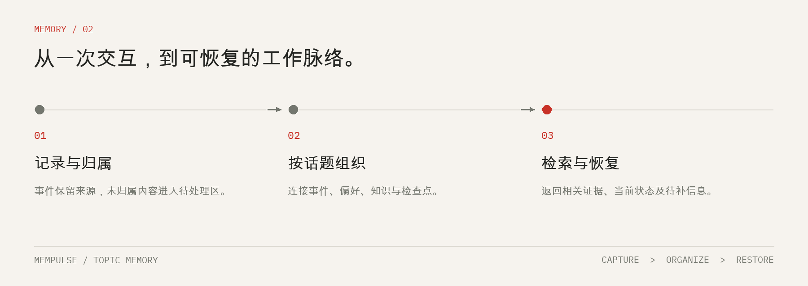
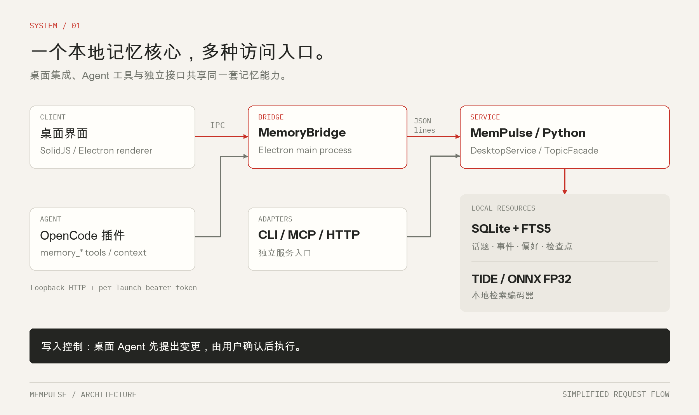

<p align="center">
  
</p>

<p align="center"><a href="README.md">English</a> · <strong>简体中文</strong></p>
<p align="center"><a href="#快速开始">快速开始</a> · <a href="#系统架构">系统架构</a> · <a href="#模型与权重">模型与权重</a> · <a href="#构建与验证">构建与验证</a> · <a href="#文档导航">文档导航</a></p>

# MemPulse

**记忆，沿着话题生长。让 Agent 在下一次会话中，接着完成。**

MemPulse 是本地优先的 Agent 话题记忆系统。它将事件、偏好、知识版本与检查点保存在本地 SQLite 中，围绕持续的话题组织上下文，帮助 Agent 跨会话检索证据、恢复任务状态。工程包含 Python 记忆服务、CLI 与 MCP 接口、基于 OpenCode 定制的桌面客户端，以及本地 TIDE 模型权重。

例如，一次平台迁移可以持续保留已经确定的决策、工具执行结果、尚未解决的问题与最近的检查点。新的会话可以检索这些内容，接着推进同一项工作。

> **许可证：**MemPulse 自研代码采用 [Apache-2.0](LICENSE)。第三方代码和模型资产保留各自适用的上游条款，详见[许可与致谢](#许可与致谢)。

## 核心能力

| 能力 | 具体行为 |
| --- | --- |
| 持续话题 | 将任务目标、事件链、证据与检查点组织为可跨会话延续的话题。 |
| 本地检索 | 使用词法检索与结构化关系，并可接入本地 ONNX 编码器。 |
| 上下文恢复 | 返回相关字段、支撑证据和缺失信息，为下一步操作提供上下文。 |
| 记忆治理 | 支持话题归属纠正、合并与拆分、偏好作用域、知识版本及定向遗忘。 |
| Agent 接入 | 提供 CLI、MCP、HTTP，以及定制桌面客户端中的 `memory_*` 工具。 |
| 完整桌面构建 | 将前端、Python 服务、ONNX Runtime 和 FP32 模型打包为独立应用。 |



在桌面集成中，未绑定话题的采集事件先进入待处理区。Agent 发起的记忆修改以提案形式呈现，由用户在界面确认后执行；检索本身不会授予写入权限。CLI 与 API 是供调用方直接使用的独立接口。

## 快速开始

### 运行安装包

请从 [GitHub Releases](https://github.com/xzgzszrh/MemPulse/releases)下载 macOS Apple Silicon DMG 及 `SHA256SUMS`；完整本地交付目录的 `release/` 下也提供这些文件。打开 DMG 即可安装应用。安装包内置 Python 运行时与 FP32 检索模型，运行该打包版本不需要另行安装 Python、Node 或 Bun。

当前 macOS 安装包尚未签名、公证。演示工作区与个人工作区使用独立数据库。Agent 对话如需调用云端大模型，请自行配置提供商和凭据；本地检索模型不承担对话生成。

### 从源码构建完整桌面应用

准备 **Python 3.10+**、**Node 24**、**Bun ^1.3.14** 和平台编译工具。macOS 需安装 Xcode Command Line Tools 或 Xcode。保持 `MemPulse/`、`OpenCode/`、`微调模型/` 和 `scripts/` 四个目录相邻。

在仓库根目录运行：

```bash
# 通过 Git 获取项目时，拉取真实权重，避免只拿到 LFS 指针。
# 完整交付目录已经包含权重时，可跳过这两条命令。
git lfs install
git lfs pull

python3 scripts/verify_models.py
bash scripts/build_desktop.sh dir
```

如果系统 `python3` 低于 3.10，先将 `MEMPULSE_BUILD_PYTHON` 指向符合要求的解释器：

```bash
export MEMPULSE_BUILD_PYTHON=/absolute/path/to/python3
bash scripts/build_desktop.sh dir
```

| 目标 | 命令 | 当前验证状态 |
| --- | --- | --- |
| macOS Apple Silicon 应用 | `bash scripts/build_desktop.sh dir` | 构建成功，打包后服务检查通过。 |
| macOS Apple Silicon DMG | `bash scripts/build_desktop.sh dmg` | 已生成，磁盘镜像校验通过。 |
| Linux / 麒麟 x86_64、ARM64 | `bash scripts/build_desktop.sh deb` | 已提供原生构建流程，待目标机器验证。 |
| Linux AppImage / RPM | 将 `deb` 替换为 `AppImage` 或 `rpm` | 需要对应打包工具，本次尚未验证。 |

统一构建入口暂未覆盖 Windows 和 Intel Mac。首次安装依赖需要联网，产物位于 `OpenCode/packages/desktop/dist/`。详见[完整构建指南](docs/BUILD.md)。

### 单独体验 Python 记忆服务

可以先使用 CLI，无需构建 Electron：

```bash
cd MemPulse
python3 -m venv .venv
source .venv/bin/activate
python -m pip install -e .

# 显式创建合成演示数据，使用独立的本地数据库。
mempulse --db .mempulse/quickstart.sqlite3 demo
mempulse --db .mempulse/quickstart.sqlite3 search '麒麟适配'
mempulse --db .mempulse/quickstart.sqlite3 health
```

随附模型基于中文 BGE 编码器微调。未配置模型时，服务仍可使用词法和结构化检索。

在 `MemPulse/` 下启用 CLI 的本地模型推理：

```bash
python -m pip install -e '.[onnx]'
export MEMPULSE_MODEL_DIR="$PWD/../微调模型/revision4-model-bundle"
mempulse --db .mempulse/quickstart.sqlite3 health
```

频繁调用时，建议使用[组件说明](MemPulse/README.md)中的常驻服务接口，避免每次短命令都重新加载模型。

## 接入 Agent

MCP stdio 配置如下，将两处绝对路径替换为实际位置：

```json
{
  "mcpServers": {
    "mempulse": {
      "command": "/absolute/path/MemPulse/.venv/bin/mempulse",
      "args": [
        "--db", "/absolute/path/MemPulse/.mempulse/memory.sqlite3",
        "mcp"
      ]
    }
  }
}
```

MCP 工具包括 `resolve_topic`、`ingest_event`、`search_memory`、`restore_context`、`list_topics` 和 `forget_memory`。OpenCode 桌面集成还提供上下文注入和专用的 `memory_*` 工具，详见[桌面集成说明](OpenCode/docs/MEMPULSE.md)（英文）。

## 系统架构



- **OpenCode / Electron / SolidJS**：提供桌面会话、终端与记忆界面。
- **MemoryBridge**：通过 IPC、本地回环网关和 JSON-lines 通信，连接渲染器、Agent 插件与 Python 进程。
- **MemPulse / Python**：负责记忆行为。SQLite 保存持久记录，FTS5 与结构化关系支撑检索，TIDE 提供本地向量编码。
- **独立接口**：通过 CLI、MCP、HTTP 使用相同的记忆能力；`MemPulse/ui/` 另保留 React/Tauri 界面。

本地记忆存储不代表 Agent 对话完全离线。所选择的大模型提供商可能接收提示词与检索出来的上下文。

## 模型与权重

完整交付包含 `微调模型/revision4-model-bundle/`：

| 文件 | 用途 |
| --- | --- |
| `encoder/model-fp32.onnx` | 桌面应用默认使用的检索编码器。 |
| `encoder/model-int8-mixed.onnx` | 实验性混合精度版本，不作为默认配置。 |
| `encoder/` 中的 tokenizer 和配置 | 输入编码与推理参数。 |
| `weights/model.safetensors` | 用于继续训练或重新导出的原始权重。 |
| `manifest.json` | 原始文件大小与 SHA-256 校验清单。 |

清单列出的模型文件合计约 **1.01 GB**。提交仓库时，大权重文件由 Git LFS 管理。桌面构建前，`scripts/verify_models.py` 会验证全部 30 个清单文件。

模型基于 `BAAI/bge-base-zh-v1.5`。它生成检索候选，不决定话题归属授权或记忆操作权限。混合 INT8 仍属实验配置，应用默认打包 FP32。评测范围和已知限制见[原始模型说明](微调模型/revision4-model-bundle/README.md)与[训练指南](MemPulse/docs/TRAINING.md)。

## 构建与验证

本次验证使用独立导出的源码目录，在 macOS ARM64 上重新安装依赖后构建。记录日期：**2026-09-17**。

| 检查 | 结果 |
| --- | --- |
| 后端与真实模型测试 | 70 项通过。 |
| 独立 WebUI | 生产构建成功，1 项验收测试通过。 |
| 桌面 TypeScript 与生产构建 | 通过。 |
| 打包后的记忆服务 | 25 项检查通过，包含 15 次检索请求和工作区持久化。 |
| macOS DMG | 生成成功，校验通过。 |

上述结果覆盖构建和打包后的服务，不代表完整桌面 GUI 人工验收，也不代表 Linux／麒麟性能验收。详见[构建验证记录](docs/BUILD-VERIFICATION.md)。

在 `MemPulse/` 目录运行后端测试：

```bash
python -m pip install -e '.[test,onnx]'
MEMPULSE_TEST_MODEL='../微调模型/revision4-model-bundle' \
  python -m pytest -q --strict-markers -m 'not standalone_webui'
```

独立 WebUI 的验收测试需先构建前端：

```bash
cd ui
npm ci
npm run build
cd ..
python -m pytest -q --strict-markers -m standalone_webui
```

OpenCode 的测试与类型检查应在对应包目录执行，并遵循该目录的 `AGENTS.md`。

## 工程目录

```text
.
├── MemPulse/                 Python 服务、CLI、MCP、测试与独立 UI
├── OpenCode/                 定制 Electron 桌面与 Agent 集成
├── 微调模型/
│   └── revision4-model-bundle/  推理与训练权重、tokenizer、校验清单
├── scripts/                  导出、模型验证与桌面构建入口
├── docs/                     文档、验证记录与 README 配图
├── README.md                 English
└── README.zh-CN.md           简体中文
```

完整本地交付中的 `release/` 单独存放安装包。构建产物和依赖可在本地生成，由 Git 忽略。比赛报告、私人数据与历史过程文件保存在公开源码目录之外。

## 文档导航

| 文档 | 语言 |
| --- | --- |
| [文档索引](docs/README.md) | 中文 |
| [完整桌面构建](docs/BUILD.md) | 中文 |
| [Python 服务与 CLI](MemPulse/README.md) | 中文 |
| [桌面集成](OpenCode/docs/MEMPULSE.md) | 英文 |
| [话题与任务契约](MemPulse/docs/TOPIC-CONTRACT-20260915.md) | 中文 |
| [训练与模型导出](MemPulse/docs/TRAINING.md) | 中文 |
| [构建验证](docs/BUILD-VERIFICATION.md) | 中文 |
| [发布准备](docs/RELEASING.md) | 中文 |

## 贡献与安全反馈

提交 Issue 或 PR 时，请说明涉及的组件、平台、复现步骤和实际验证结果，遵循[贡献指南](docs/CONTRIBUTING.md)及组件开发约定。不要在公开报告中附带凭据或个人记忆数据库。

安全问题请先阅读[安全反馈说明](docs/SECURITY.md)。敏感报告请使用仓库的私密漏洞报告入口。

## 许可与致谢

工程包含采用不同许可证的组件：

- **OpenCode**：保留 [MIT 许可证](OpenCode/LICENSE)。MemPulse 为独立定制项目，与上游维护者无隶属关系。
- **源自 Episodic 的指纹代码**：保留 [Apache-2.0 许可证](MemPulse/src/mempulse/_vendor/LICENSE)，复用范围见 [UPSTREAM](MemPulse/docs/UPSTREAM.md)。
- **MemPulse 自研代码**：采用 [Apache-2.0](LICENSE)，署名与来源信息见 [NOTICE](NOTICE)。
- **模型与依赖**：遵循各自条款。BGE 基础模型的[官方模型卡](https://huggingface.co/BAAI/bge-base-zh-v1.5)标注 MIT，已附带上游 [MIT 声明](docs/licenses/BGE-MIT.txt)。

来源索引见[第三方说明](docs/THIRD_PARTY.md)。
