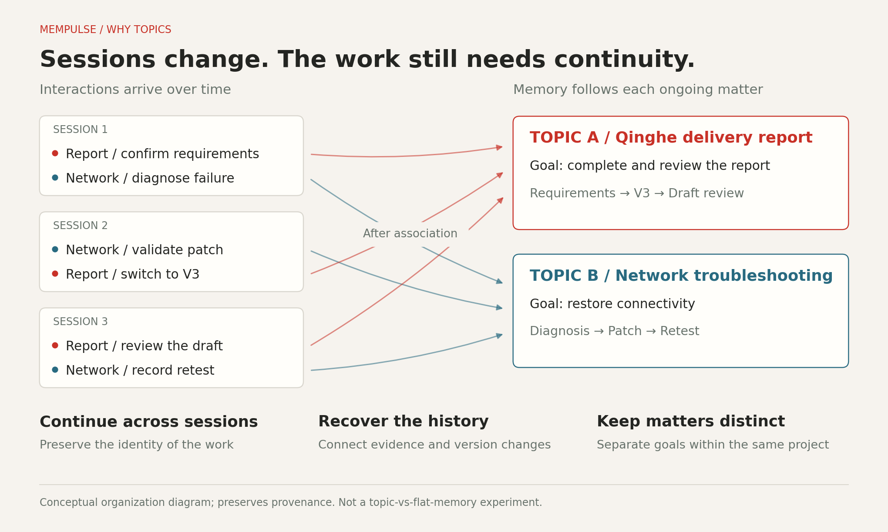
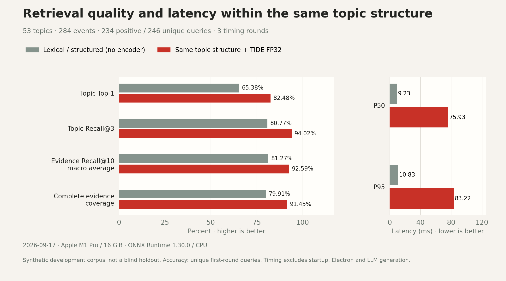
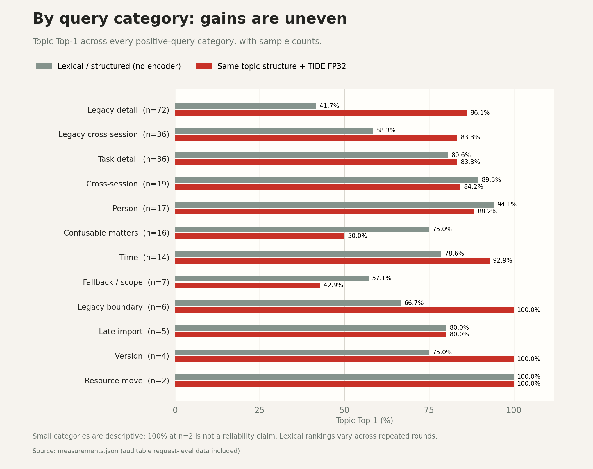

# Topic memory: rationale and measured results

**English** · [简体中文](README.zh-CN.md)

## Two figures, two different questions

**Why organize by topic?** Sessions change and a single session can contain multiple matters. A persistent topic maintains the identity and boundary of the work, connects its source events, and retains context needed to resume across sessions. The diagram explains this design rationale; it is not a performance experiment.



**How does the current implementation perform?** On 2026-09-17 we reran the existing synthetic benchmark against the public source, comparing lexical/structured retrieval with TIDE FP32 added to the same topic structure. **Both conditions use topics. This does not measure a causal benefit of topics over flat or session-only memory.** That ablation has not been performed.



## Dataset and method

- 53 topics and 284 events; 246 unique questions, including 234 positives and 12 absent/ambiguous cases.
- 192 questions participated in development; another 54 were authored from the same fictional corpus. No independent human blind annotation, real-user holdout or verified absence of training overlap.
- Three rounds per configuration: 1,476 retrieval calls. Accuracy uses unique first-round positive questions; repeated rounds are timing/stability observations, not additional independent accuracy samples.
- Macro evidence Recall@10 averages the fraction of gold source events retrieved per question, at up to 10 returned events. Micro recall counts all gold events together. Complete coverage requires every gold event for a question.
- Topic Top-1 and Recall@3 measure whether the target topic ranks first or in the first three candidates. They do not measure automatic topic creation/binding accuracy.
- The model is loaded before timing; the query embedding cache is cleared before each retrieval. Timing includes planning, encoding, candidate retrieval and evidence ranking, but excludes startup, Electron UI/IPC and LLM generation.
- Apple M1 Pro, 16 GiB, macOS arm64, Python 3.13.5 and ONNX Runtime 1.30.0 / CPUExecutionProvider. Model and Python source hashes are included; source hashes were unchanged during the run.
- Lexical rankings/returned events are not fully consistent across rounds; FP32 results are consistent. Lexical ties, generated IDs and times can produce small rerun differences. This is one local run, not a cross-hardware or multi-seed statistical claim.

## Data / 数据

| Metric / 指标 | Lexical + structure / 词法与结构化 | + TIDE FP32 |
| --- | ---: | ---: |
| 话题 Top-1 / Topic Top-1 | 65.38% | 82.48% |
| 话题 Recall@3 / Topic Recall@3 | 80.77% | 94.02% |
| 证据 Recall@10（宏）/ Evidence Recall@10 (macro) | 81.27% | 92.59% |
| 证据 Recall@10（微）/ Evidence Recall@10 (micro) | 82.88% | 92.12% |
| 全部证据覆盖 / Complete evidence coverage | 79.91% | 91.45% |
| P50 (ms) | 9.23 | 75.93 |
| P95 (ms) | 10.83 | 83.22 |

- [Machine-readable measurements / 指标与方法](2026-09-17/measurements.json)
- [1,476 retrieval request records / 检索明细](2026-09-17/retrieval-requests.jsonl)
- [306 context request records / 上下文明细](2026-09-17/context-requests.jsonl)
- [Measured source snapshot / 被测版本](https://github.com/xzgzszrh/MemPulse/tree/4ceda19de2a3e30e60ff3bf8d36d11db1cc81292)

## Gains, costs and weak categories

FP32 improved topic Top-1 by **17.09 percentage points** and macro evidence recall by **11.32 points**. Complete coverage rose from **187/234** to **214/234**, while P95 rose from **10.83 ms** to **83.22 ms**.

Improvements are uneven. FP32 topic Top-1 is **8/16 (50%)** for confusable matters and **3/7 (42.86%)** for fallback/scope queries, both below this run's lexical baseline. Every positive category is shown below. A 100% score at n=2 is not a real-world reliability estimate.



## Is the context supplied to an agent sufficient?

The real `desktop_entry.py` JSON-lines process was exercised with 54 authored questions, 48 of them positive:

| Condition | Complete event-evidence coverage |
| --- | ---: |
| No topic binding | 44/48 (91.67%) |
| Evaluator supplies the correct topic ID | 46/48 (95.83%) |

This measures coverage under those conditions, not automatic topic recognition. Bound requests run after unbound requests and benefit from cache, so the timing difference is not presented as a causal binding benefit. No answer model was called; final-answer accuracy was not measured.

Evidence can still be missed: the network diagnosis question `fresh:021` has 3 gold events but unbound context covers 2; packaging question `fresh:015` has 2 gold events but context covers 1. Queries and counts are retained in the context request data.

## Validation limits

- Structured preference resolution passed 28/32 cases; knowledge-conflict resolution passed 44/48. Correlated template variants are not independent natural samples or an NLP extraction score.
- Of 19 targeted boundary probes, 9 passed, 9 failed and 1 was untested. Names and outcomes are in measurements.json. They are a diagnostic list, not a population-level product accuracy metric.
- Failures cover state updates, time semantics, context retention and data-governance protections. Passing ordinary regression tests does not establish these boundaries. Detailed diagnostic artifacts remain separate; public data excludes credential probe strings and databases.
- Kylin hardware/SDK, independent real-user scenarios, final LLM answer quality and a topic-vs-flat-memory ablation remain unmeasured.

## Reproduce / 复现

Run the first two commands from `MemPulse/`, with ONNX and test dependencies installed. Use new output directories every time; existing runs are never overwritten. 从 `MemPulse/` 执行前两条命令，每次使用新输出目录。以下过程仅建立隔离测试库，不需要 GUI 或模型提供商凭据。

```bash
env -u MEMPULSE_MODEL_DIR PYTHONPATH=src .venv/bin/python scripts/evaluate_competition.py \
  --model ../微调模型/revision4-model-bundle \
  --output ../artifacts/benchmark-new-run --rounds 3

env -u MEMPULSE_MODEL_DIR PYTHONPATH=src .venv/bin/python scripts/audit_memory_boundaries.py \
  --output ../artifacts/boundaries-new-run

cd ..
python3 scripts/prepare_evaluation_data.py \
  --run artifacts/benchmark-new-run --boundaries artifacts/boundaries-new-run \
  --source-root MemPulse --output docs/evaluation/my-run \
  --cpu 'YOUR ACTUAL CPU' --memory-gib 16 --onnxruntime-version 'YOUR ACTUAL VERSION'
```

Replace hardware/runtime labels with the measured machine's actual values. The exporter verifies Python source hashes before copying metrics. 请填写实际 CPU、内存容量与 ONNX Runtime 版本；不要沿用其他机器的硬件标签。脚本退出码 0 只代表评测执行完成，实际通过情况应以结果文件为准。

Render figures from repository root (optional documentation dependency: Matplotlib 3.10.8):

```bash
python3 scripts/render_evaluation_figures.py \
  --data docs/evaluation/2026-09-17/measurements.json \
  --cjk-font /path/to/a/CJK-font.ttf
```

The renderer produces PNG and SVG variants in `docs/assets/evaluation/`; font glyphs are embedded as SVG paths. 原始比赛报告与过程文件继续独立存放；公开目录仅包含本次复测的指标、精简明细和绘图源码。数据库与本机路径不随公开数据分发。
