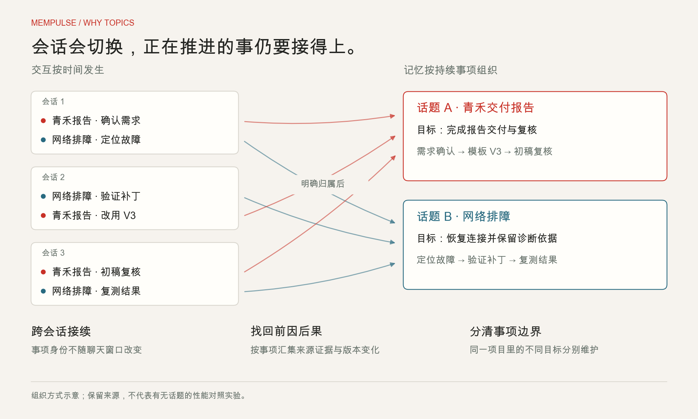
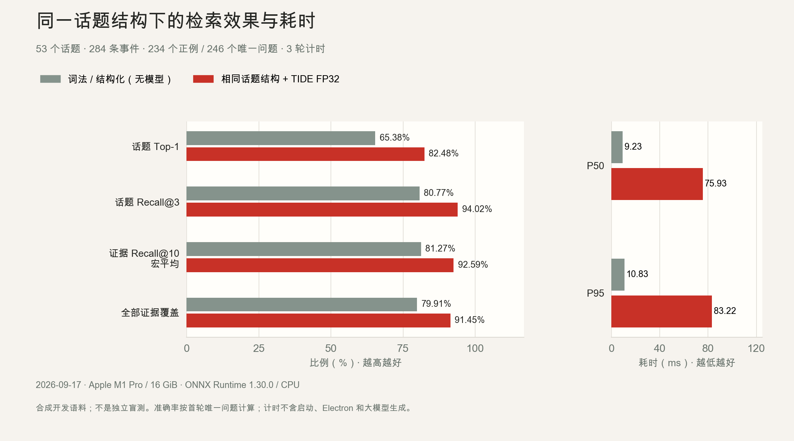
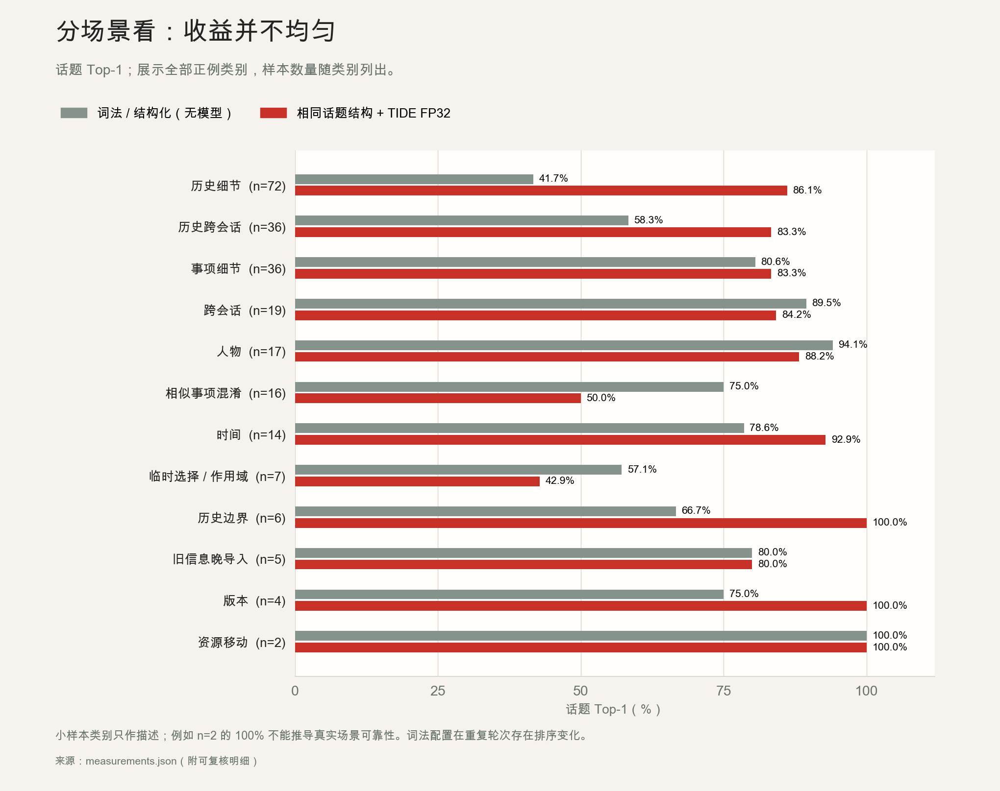

# 话题记忆：组织动机与实测效果

[English](README.md) · **简体中文**

## 两类图，回答两个问题

**为什么按话题组织**：会话会切换、不同事项可能出现在同一会话中。以话题保存持续事项的身份和边界，可以把相关来源放回同一条工作脉络，保留跨会话恢复所需的信息。下图解释这一设计目的，不是性能实验。



**实际检索效果如何**：2026-09-17 从当前公开源码重跑既有合成基准，比较相同话题结构下的词法/结构化检索与加入 TIDE FP32 的配置。**两组都有话题；不能据此声称“话题分类比不分类提高了多少”。** 当前尚未测量与扁平记忆或纯会话组织的消融对照。



## 数据集与方法

- 53 个话题、284 条事件；246 个唯一问题，其中 234 个正例、12 个无答案或歧义例。
- 192 题参与过开发，另 54 题根据同一既有虚构语料编写；不是独立人工盲标或真实用户测试，训练语料重合未核验。
- 两配置各 3 轮，共 1,476 次检索。准确率只统计首轮唯一正例；重复请求仅用于计时与稳定性观察。
- 证据宏 Recall@10：每题在返回的最多 10 条事件中召回标注事件的比例，再按问题平均。微召回按全部标注事件计数。全部证据覆盖要求该题的所有标注事件都被返回。
- Topic Top-1 / Recall@3 统计正确话题是否排在第 1 / 前 3 位。它们不代表话题创建或自动绑定的正确率。
- 模型已加载，每次检索前清空查询编码缓存。耗时包含检索规划、编码、候选检索与证据排序，不含启动、Electron 界面/IPC 和大模型生成。
- Apple M1 Pro、16 GiB、macOS arm64、Python 3.13.5、ONNX Runtime 1.30.0 / CPUExecutionProvider。模型 SHA-256 与全部被测 Python 文件哈希随数据保留，运行前后源码一致。
- 词法配置的三轮排序/返回并非完全一致；FP32 三轮一致。词法基线受并列排序、生成的身份及时间等因素影响，复跑数值可能有小幅差异。仅一次本机运行，未做跨机器/多进程种子的统计推断。

## Data / 数据

| Metric / 指标 | Lexical + structure / 词法与结构化 | + TIDE FP32 |
| --- | ---: | ---: |
| 话题 Top-1 / Topic Top-1 | 65.38% | 82.48% |
| 话题 Recall@3 / Topic Recall@3 | 80.77% | 94.02% |
| 证据 Recall@10（宏）/ Evidence Recall@10 (macro) | 81.27% | 92.59% |
| 证据 Recall@10（微）/ Evidence Recall@10 (micro) | 82.88% | 92.12% |
| 全部证据覆盖 / Complete evidence coverage | 79.91% | 91.45% |
| P50 (ms) | 9.23 | 75.93 |
| P95 (ms) | 10.83 | 83.22 |

- [Machine-readable measurements / 指标与方法](2026-09-17/measurements.json)
- [1,476 retrieval request records / 检索明细](2026-09-17/retrieval-requests.jsonl)
- [306 context request records / 上下文明细](2026-09-17/context-requests.jsonl)
- [Measured source snapshot / 被测版本](https://github.com/xzgzszrh/MemPulse/tree/4ceda19de2a3e30e60ff3bf8d36d11db1cc81292)

## 收益、代价与弱项

本轮 FP32 的话题 Top-1 提升 17.09 个百分点；证据宏召回提升 11.32 个百分点。找齐全部证据从 **187/234** 增至 **214/234**，但 P95 从 **10.83 ms** 增至 **83.22 ms**。

收益并不均匀：相似事项混淆组只有 16 题，FP32 Top-1 为 **8/16（50%）**；临时选择/作用域组为 **3/7（42.86%）**，两者均低于本轮词法配置。下图包含所有正例类别，不只展示表现最好的部分；n=2 的 100% 不能推出真实场景可靠性。



## 进入 Agent 的上下文是否够用？

使用真实 `desktop_entry.py` JSON-lines 子进程，对 54 个自编问题进行测试；其中正例 48 个。两种条件的完整事件证据覆盖分别为：

| 条件 | 完整证据覆盖 |
| --- | ---: |
| 未绑定话题 | 44/48（91.67%） |
| 评测器直接提供正确话题 ID | 46/48（95.83%） |

这显示指定条件下的证据覆盖，不是模型自动识别话题的成绩。已绑定组在未绑定组之后执行，有缓存优势，因此不将耗时差解释为绑定的因果收益。没有调用回答大模型，也没有测最终回答准确率。

仍有漏证据案例，例如 `fresh:021` 的网络排障问题需要 3 条标注事件，未绑定上下文只覆盖 2 条；`fresh:015` 的打包问题需要 2 条，返回上下文只覆盖 1 条。对应问题和计数已保留在上下文明细中。

## 当前验证边界

- 结构化偏好解析 28/32，知识冲突解析 44/48；固定模板变体并非独立自然样本，也不是自然语言提取准确率。
- 19 个专项边界探针中，9 个通过、9 个失败、1 个未测。原始探针名称与结果见 measurements.json；这是诊断清单，不计算为产品总体准确率。
- 未通过项覆盖状态更新、时间语义、上下文保留和数据治理保护，不能用普通回归测试通过代替这些边界结果。完整诊断明细保留在独立评测目录；公开数据不包含凭据测试串或数据库。
- 未测麒麟目标机/SDK、独立真实用户场景、最终大模型回答质量，也未证明话题组织相对扁平结构的因果提升。正式声称这些效果前需要对应实验。

## Reproduce / 复现

Run the first two commands from `MemPulse/`, with ONNX and test dependencies installed. Use new output directories every time; existing runs are never overwritten. 从 `MemPulse/` 执行前两条命令，每次使用新输出目录。以下过程仅建立隔离测试库，不需要 GUI 或模型提供商凭据。

```bash
env -u MEMPULSE_MODEL_DIR PYTHONPATH=src .venv/bin/python scripts/evaluate_competition.py \
  --model ../微调模型/revision4-model-bundle \
  --output ../artifacts/benchmark-new-run --rounds 3

env -u MEMPULSE_MODEL_DIR PYTHONPATH=src .venv/bin/python scripts/audit_memory_boundaries.py \
  --output ../artifacts/boundaries-new-run

cd ..
python3 scripts/prepare_evaluation_data.py \
  --run artifacts/benchmark-new-run --boundaries artifacts/boundaries-new-run \
  --source-root MemPulse --output docs/evaluation/my-run \
  --cpu 'YOUR ACTUAL CPU' --memory-gib 16 --onnxruntime-version 'YOUR ACTUAL VERSION'
```

Replace hardware/runtime labels with the measured machine's actual values. The exporter verifies Python source hashes before copying metrics. 请填写实际 CPU、内存容量与 ONNX Runtime 版本；不要沿用其他机器的硬件标签。脚本退出码 0 只代表评测执行完成，实际通过情况应以结果文件为准。

Render figures from repository root (optional documentation dependency: Matplotlib 3.10.8):

```bash
python3 scripts/render_evaluation_figures.py \
  --data docs/evaluation/2026-09-17/measurements.json \
  --cjk-font /path/to/a/CJK-font.ttf
```

The renderer produces PNG and SVG variants in `docs/assets/evaluation/`; font glyphs are embedded as SVG paths. 原始比赛报告与过程文件继续独立存放；公开目录仅包含本次复测的指标、精简明细和绘图源码。数据库与本机路径不随公开数据分发。
